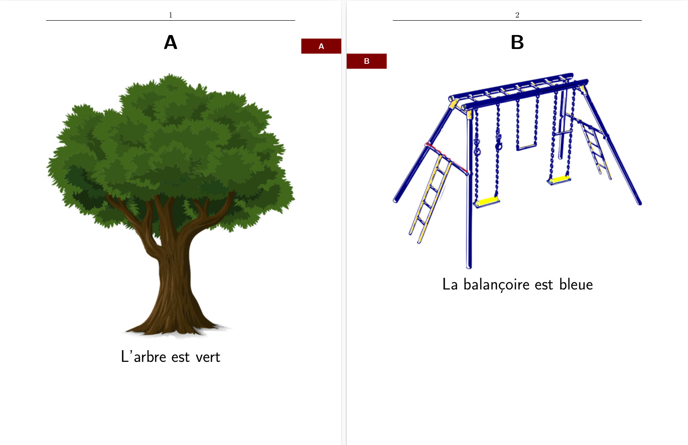

# Personal alphabet book (abécédaire personnalisé) in LaTeX

Just do:

    make

- `alphabetbook.pdf` will contain the desired A5 alphabet book (you may want to `pdflatex alphabet-book` again).
- `alphabetbook-print.pdf` will contain the A4 booklet version, ready to print (landscape, double-sided long edge).

## Thanks

Thanks Tobi and chejnik's answers on TeX Stack Exchange. I was looking for the name of such *intercalaires* in English; it seems to be called either "divider" or "thumb index":
https://tex.stackexchange.com/questions/57031/how-to-set-a-letter-to-the-margin-of-the-page-and-position-it-vertically-accordi

To make it a printable booklet, I used to enjoy the `2up` package a lot but it seems that `pdfpages` is both more recent and customizable.

Images come from [Pixabay](https://pixabay.com/) and are under royalty-free license.

## Other references

- [Another solution on TeX.SE](https://tex.stackexchange.com/questions/657595/special-formatting-for-thumb-index-custom-colors-and-sizing)
- [Simple way to change the font to another standard](https://www.overleaf.com/learn/latex/Font_typefaces) on Overleaf
- [The equivalent for slides](https://tex.stackexchange.com/questions/279965/beamer-pages-in-the-sidebar)
